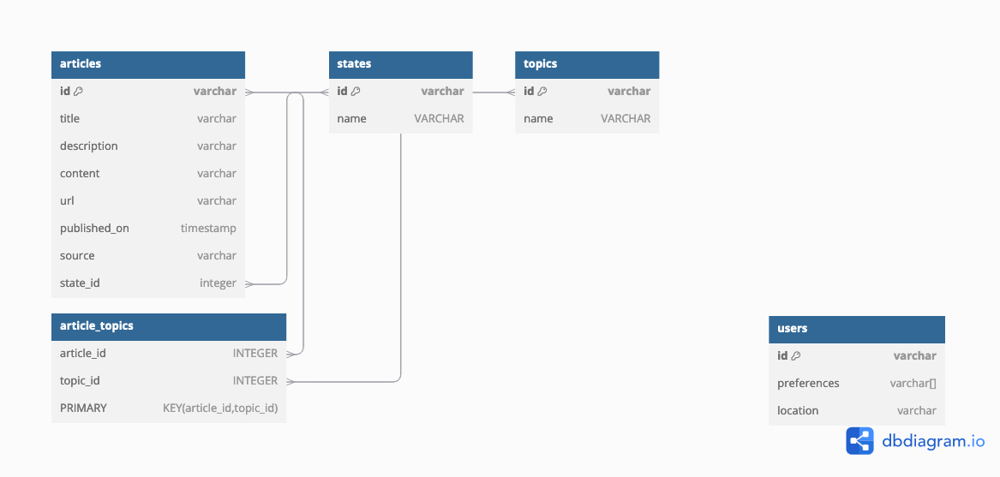

# Documentation

## Quick start
Clone the repository and up the compose file. This will start the API and DB and add seed data so that you can immediately begin working with service.
```shell
$ git clone https://github.com/code-rush/news-aggregator-service.git
$ cd news-aggregator-service
$ docker compose build
$ docker compose run --rm app npm run migrate:up
$ docker compose run --rm app npm run seed
$ docker compose up
```

## Development
**Prerequisites**

- *[Docker Desktop](https://www.docker.com/products/docker-desktop)*
- *[Node v22](https://nodejs.org/en)*

**Run the app in development mode**
```shell
$ docker compose up
```

### Migrations
**Migrate to Latest**
```sh
$ docker compose run --rm app npm run migrate:up
```

**Migrate down by 1 migrations**
```sh
$ docker compose run --rm app npm run migrate:down
```

**Create new migration**
```sh
$ docker compose run --rm app npm run migrate:create
```

### Seed Database
**Populate database with seed data**
```sh
$ docker compose run --rm app npm run seed
```

## Configuring scheduler that runs periodically
To enable scheduler that runs periodically and retrieves news articles from NewsAPI.
1. Go to `compose.yaml` and change `TASK_SCHEDULER_ENABLED` to `true`
2. Replace the placeholder for `NEWSAPI_API_KEY` with your API_KEY


# System Architecture

### Functional Requirements
1. User is able to view list of all news articles
2. User is able to search for a news articles based on state, topic and some keyword
3. User is able to post an article / System parses articles from sources or publications
4. User has preferences to filter news for their feed
5. User is able to subscribe to articles related to states/topics.

### Non-Functional Requirements
1. Read heavy - low latency under 100ms
2. Highly available - 99.99%
3. Handle high throughput, surges on a specific events when something is expected to come out
4. Consistent when writing

### Core Entities
- Article
- Topic
- State
- User



**Indexes**
- Partition Key: topic_id

### API
- GET /news/ -> Partial<Articles>
- GET /news?state=x&topic -> Partial<Articles>
- GET /news/:id -> Articles
- POST /news
```{
    title,
    description,
    content,
    ...
  }
```


### Implementation Enhancement Considerations
1. Error Handling: Implement robust error handling and logging to manage issues with API calls or database operations.
2. Database Efficiency: Consider using bulk insert operations if processing many articles at once.
3. Deduplication: Implement a mechanism to avoid storing duplicate articles, possibly by checking URLs or content similarity.
4. Archiving: Set up a system to archive older articles to maintain database performance.

## SRE Matrices
### SLA (Service Level Agreement)
SLAs represent the commitment to your users about the level of service they’ll receive:
1. Availability: The app will be accessible 99.9% of the time within a calendar month.
2. Response Time: The app will respond to user requests within 2 seconds 95% of the time.
3. Data Freshness: Latest news articles will be available within 10 minutes of publication on the source site, 99% of the time.

### SLI (Service Level Indicator)
SLIs are metrics that measure specific aspects of the service’s performance:
1. Uptime: The ratio of successful requests to total requests over time, ensuring that the app remains accessible.
2. Latency: Time taken to load the app or specific news pages, typically measured as p95 or p99 response times.
3. Content Update Latency: The time taken to fetch and display newly published articles after they appear on the source.

### SLO (Service Level Objective)
SLOs set specific targets for SLIs, defining acceptable thresholds:
1. Uptime SLO: 99.9% uptime per month.
2. Latency SLO: 95% of requests will complete within 2 seconds, with 99% completing within 3 seconds.
3. Content Freshness SLO: 95% of new content will be available within 5 minutes of being published on source sites.

Setting these metrics will help ensure that the app provides a smooth, timely, and reliable experience.

## Fault tolerance and handling spikes in traffic
Fault tolerance and availability are crucial to ensure the app is always accessible and can handle sudden spikes in traffic or unexpected database failures. Here’s a comprehensive strategy:

1. High Availability Setup for Databases
    1. **Elasticsearch**
        - Cluster Configuration: Deploy Elasticsearch in a multi-node cluster with multiple master and data nodes to avoid single points of failure.
        - Sharding and Replication: Use sharding for load distribution and replication to ensure data redundancy. Set up at least one replica per shard, so if one node fails, a replica is available.
        - Cross-Cluster Replication (CCR): If operating across multiple regions, set up CCR for real-time data replication, enhancing fault tolerance across locations.
    2. **DocumentDB**
        - Multi-Region Replication: For global availability, set up multi-region replication to ensure the data remains available even if one region fails.
        - Automatic Failover: Use built-in automatic failover so that if the primary node or region fails, DocumentDB can promote a secondary node or region to primary.
        - Backups and Snapshots: Regularly create automatic snapshots for point-in-time recovery, which helps protect against accidental deletions or corruption.

2. Cache Layer with Redis or Memcached
    - Set up a distributed in-memory cache like Redis or Memcached to cache frequently accessed news data. This setup:
    - Reduces Load on Primary Databases: By caching popular or recent news articles, you reduce load on Elasticsearch and DocumentDB.
    - Increases Data Availability: If there’s a temporary outage in the database, recent news content can still be served from the cache.

3. Load Balancing
    - Application Load Balancers: Distribute traffic across multiple instances of your application servers. Use Application Load Balancers (ALBs) to ensure that if one server instance fails, traffic is rerouted to healthy instances.
    - Database Load Balancing: Implement load balancing across database read replicas, especially for read-heavy applications like news apps. This helps distribute load evenly and ensures high availability even if one replica becomes unavailable.

4. Auto-Scaling of Application and Database Nodes
    - Horizontal Scaling: Implement horizontal auto-scaling for your application servers, Elasticsearch nodes, and DocumentDB replicas based on traffic and load patterns. This allows your app to handle sudden spikes in traffic without service degradation.
    - Elastic IP for Database Nodes: Use Elastic IPs for the Elasticsearch and DocumentDB endpoints so they remain accessible even if underlying instances change due to scaling or failover.

5. Circuit Breakers and Rate Limiting
    - Circuit Breakers: Use circuit breakers to prevent cascading failures across services. For instance, if Elasticsearch or DocumentDB becomes overloaded, the circuit breaker stops making new requests until the system stabilizes.
    - Rate Limiting: Implement rate limiting to manage API requests, preventing overloads during traffic spikes.

6. Disaster Recovery (DR) Strategy
    - Multi-Region DR: Set up a disaster recovery plan where critical data is replicated across regions, so if one region fails, you can failover to another region with minimal downtime.
    - Point-in-Time Recovery: Enable point-in-time recovery for DocumentDB to quickly recover from data corruption incidents.

7. Monitoring and Alerting
    - Real-Time Monitoring: Use monitoring tools like Prometheus, Grafana, or Elastic’s Kibana to track metrics such as latency, error rates, and CPU/memory utilization.
    - Alerting on Thresholds: Set up alerts for critical thresholds (e.g., high error rates, high latency, node failures) so the team can quickly respond to potential issues.

8. Regular Backups and Restore Testing
    - Automated Backups: Set automated daily backups for both Elasticsearch indices and DocumentDB. Ensure backups are stored in a separate, durable storage service.
    - Periodic Restore Testing: Regularly test restoring from backups to verify that recovery procedures work smoothly in case of an actual failure.

9. Graceful Degradation
    - In case of partial service outages (e.g., Elasticsearch down), ensure the app can still function with limited features or data (like serving cached content or returning fewer news articles), rather than failing completely.

These mechanisms help ensure that the service remains resilient, even in the face of database or application-level failures, by combining redundancy, failover, and load management strategies.