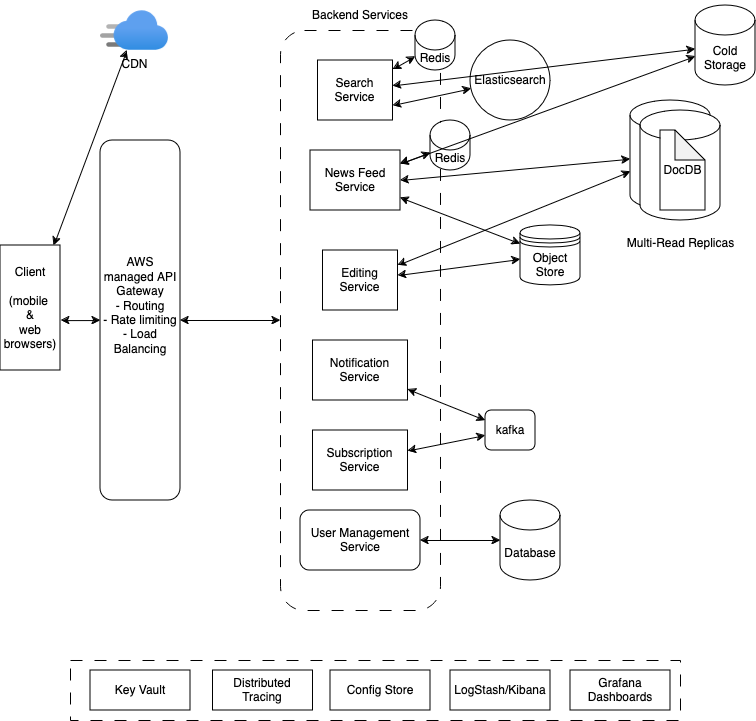

# Documentation

## Quick start
Clone the repository and up the compose file. This will start the API and DB and add seed data so that you can immediately begin working with service.
```shell
$ git clone https://github.com/code-rush/news-aggregator-service.git
$ cd news-aggregator-service
$ docker compose build
$ docker compose run --rm app npm run migrate:up
$ docker compose run --rm app npm run seed
$ docker compose up
```

## Development
**Prerequisites**

- *[Docker Desktop](https://www.docker.com/products/docker-desktop)*
- *[Node v22](https://nodejs.org/en)*

**Run the app in development mode**
```shell
$ docker compose up
```

### Migrations
**Migrate to Latest**
```sh
$ docker compose run --rm app npm run migrate:up
```

**Migrate down by 1 migrations**
```sh
$ docker compose run --rm app npm run migrate:down
```

**Create new migration**
```sh
$ docker compose run --rm app npm run migrate:create
```

### Seed Database
**Populate database with seed data**
```sh
$ docker compose run --rm app npm run seed
```

## Configuring scheduler that runs periodically
To enable scheduler that runs periodically and retrieves news articles from NewsAPI.
1. Go to `compose.yaml` and change `TASK_SCHEDULER_ENABLED` to `true`
2. Replace the placeholder for `NEWSAPI_API_KEY` with your API_KEY


# System Architecture

### Functional Requirements
1. User is able to view list of all news articles
2. User is able to search for a news articles based on state, topic and some keyword
3. User is able to post an article / System parses articles from sources or publications
4. User has preferences to filter news for their feed

### Non-Functional Requirements
1. Read heavy - low latency search
2. Highly available - 99.99%
3. Handle high throughput, surges on a specific day when something is expected to come out.

### Core Entities
- Articles
- User

### API
- GET /news/ -> Partial<Articles>
- GET /news?state=x&topic -> Partial<Articles>
- GET /news/:id -> Articles
- POST /news
```{
    title,
    description,
    content,
    ...
  }
```



### Implementation Enhancement Considerations
1. Error Handling: Implement robust error handling and logging to manage issues with API calls or database operations.
2. Database Efficiency: Consider using bulk insert operations if processing many articles at once.
3. Deduplication: Implement a mechanism to avoid storing duplicate articles, possibly by checking URLs or content similarity.
4. Archiving: Set up a system to archive older articles to maintain database performance.

### Improving Accuracy
To improve accuracy, we could implement either one or in combination of the following:
1. Use Natural Language Processing (NLP) libraries to perform named entity recognition, which can more reliably identify location names and classifying documents into topics.
2. Implement context-aware parsing to distinguish between state names used in legislative contexts and other mentions.
3. Utilize the sources parameter in the API request to focus on state-specific news sources, which may improve the relevance of results
4. Employ a scoring system that weighs multiple factors (e.g., frequency of state mention, presence in title vs. description) to determine the most likely state for each article.
